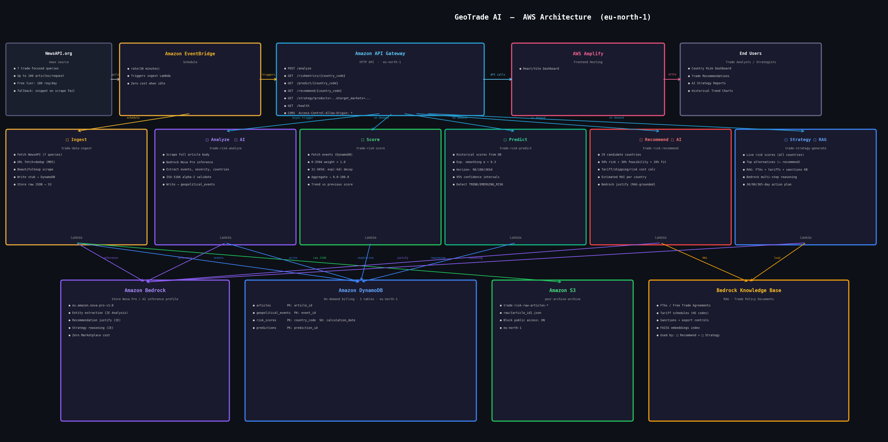

## GeoTrade AI

GeoTrade AI is a real-time geopolitical trade risk intelligence system built on AWS. It automatically ingests global news every 30 minutes, uses Amazon Bedrock Nova Pro to extract trade risk signals, and converts them into actionable country-wise risk scores, enabling trade teams to make faster, data-driven decisions.

The system is fully serverless, built on AWS Lambda, DynamoDB, API Gateway, S3, EventBridge, and Amplify, with zero fixed infrastructure cost. It provides risk scoring and AI-generated trade strategies grounded in a trade policy knowledge base via RAG.

## Architecture

## Tech Stack
- Amazon Bedrock (Nova Pro) - AI analysis + strategy
- AWS Lambda (8 functions) - serverless pipeline
- Amazon DynamoDB - 5 tables
- Amazon S3 - raw article storage
- Amazon API Gateway - REST endpoints
- AWS Amplify - frontend hosting
- Amazon EventBridge - scheduled ingestion

## Live Demo
- Frontend: https://main.d2r8hf0qbujwh4.amplifyapp.com
- API: https://k4zbat7tx6.execute-api.eu-north-1.amazonaws.com